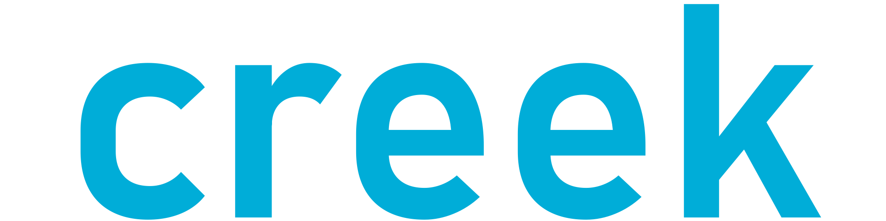

<div align="center">
    
</div>
<div align="center">
    <a href="https://github.com/0l1v3rr/creek">Creek</a> is a fully-featured Streams library 
    for <a href="https://go.dev/">Go</a>. <br>
    Creek creates wrappers around a specific data source (array or slice), allowing us to operate with that data source and making bulk processing convenient and fast.
    Creek helps you to follow the <a href="https://en.wikipedia.org/wiki/Functional_programming">functional programming</a> paradigms.   
    Creek is not just a Streams library, you can work with arrays and slices more easily than ever.
</div>
<br>
<div align="center">
    <a href="https://github.com/0l1v3rr/creek/releases">
        
    </a>
    <a href="https://github.com/0l1v3rr/creek/actions">
        
    </a>
    <a href="https://github.com/0l1v3rr/creek/blob/master/LICENSE">
        
    </a>
    <a href="https://github.com/0l1v3rr/creek/blob/master/go.mod">
        
    </a>
    <a href="https://goreportcard.com/report/github.com/0l1v3rr/creek">
        
    </a>
</div>

<hr>

## Why creek?
If you've always missed the functional programming paradigms from Golang, or ever wanted to work with streams in Go, this library will totally fit your needs.  
If you are from a [C#](https://docs.microsoft.com/en-us/dotnet/csharp/) or a [Java](https://www.java.com/en/) background, working with this library going to be easy since creek is very similar to [Linq](https://docs.microsoft.com/en-us/dotnet/csharp/programming-guide/concepts/linq/) or the [Java Streams API](https://docs.oracle.com/javase/8/docs/api/java/util/stream/package-summary.html).  
Even if you just want to work with slices and arrays more conveniently and easily, but don't like functional programming, you can do that too.

<hr>

## Installation
Before installing this library, you need to have [Go](https://go.dev/dl/) installed.  
> Since creek uses generics, version 1.18+ is required.  

Now, you can initialize a project and use this library:  
```sh
go get -u github.com/0l1v3rr/creek
```

<hr>

## Quick start
```go
package main

import (
    "fmt"

    "github.com/0l1v3rr/creek"
)

func main() {
    arr := []int{1, 8, 2, 14, 22, 4, 7, 92}

    result := creek.FromArray(arr).Filter(func(item int) bool {
        return item > 3
    }).OrderBy().Collect()

    fmt.Println(result) // [4 7 8 14 22 92]
}
```

<hr>

# Table of Contents
- [Table of Contents](#table-of-contents)
  - [Create stream](#create-stream)
    - [Empty stream](#empty-stream)
    - [Stream from regular arrays and slices](#stream-from-regular-arrays-and-slices)
    - [Stream from parameter values](#stream-from-parameter-values)
    - [Stream from a file](#stream-from-a-file)
    - [Stream from struct arrays](#stream-from-struct-arrays)
  - [Important](#important)
  - [Functions](#functions)
    - [All](#all)
    - [Append](#append)
    - [AppendAt](#appendat)
    - [AppendIf](#appendif)
    - [ArrEquals](#arrequals)
    - [Average](#average)
    - [Clear](#clear)
    - [Collect](#collect)
    - [Contains](#contains)
    - [Count](#count)
    - [Distinct](#distinct)
    - [ElementAt](#elementat)
    - [ElementAtOrElse](#elementatorelse)
    - [Equals](#equals)
    - [Filter](#filter)
    - [Find](#find)
    - [FindIndex](#findindex)
    - [FindLast](#findlast)
    - [FindLastIndex](#findlastindex)
    - [First](#first)
    - [ForEach](#foreach)
    - [IndexOf](#indexof)
    - [IsEmpty](#isempty)
    - [IsNotEmpty](#isnotempty)
    - [Join](#join)
    - [Last](#last)
    - [LastIndexOf](#lastindexof)
    - [Limit](#limit)
    - [Map](#map)
    - [Max](#max)
    - [MaxIndex](#maxindex)
    - [Min](#min)
    - [MinIndex](#minindex)
    - [OrderBy](#orderby)
    - [OrderByDescending](#orderbydescending)
    - [Remove](#remove)
    - [RemoveAt](#removeat)
    - [RemoveDuplicates](#removeduplicates)
    - [RemoveIf](#removeif)
    - [RemoveWhere](#removewhere)
    - [Replace](#replace)
    - [ReplaceWhere](#replacewhere)
    - [Reverse](#reverse)
    - [Shuffle](#shuffle)
    - [Slice](#slice)
    - [Some](#some)
    - [Sum](#sum)
    - [Wait](#wait)
  - [Method chaining](#method-chaining)
  - [Download and build from source](#download-and-build-from-source)
  - [Creek VS Linq VS Java Streams API](#creek-vs-linq-vs-java-streams-api)
    - [Linq](#linq)
    - [Java Streams API](#java-streams-api)
    - [Creek](#creek)
  - [Contributing](#contributing)
  - [License](#license)

<hr>

## Create stream
You can create a stream from almost every type of array or slice.

### Empty stream
The `Empty` function returns an empty stream.
```go
emptyStream := creek.Empty[int]()
```

### Stream from regular arrays and slices
The supported types are the following:
> ```go
> string | byte | float32 | float64 | int | int16 | int32 | int64 | uint16 | uint32 | uint64
> ```
In order to create a stream, use the `FromArray` function:
```go
// slice
arr := []int{1, 8, 2, 14, 22, 4, 7, 92}
intStream := creek.FromArray(arr)

// array
arr2 := [3]string{"One", "Two", "Three"}
stringStream := creek.FromArray(arr2[:])
```

### Stream from parameter values
```go
stream := creek.FromValues("Apple", "Strawberry", "Peach")
```

### Stream from a file
The `FromFile` function creates a stream from a file.  
The file is read line by line. Each line is an element of the stream.  
Parameters:
- `os.File` file
```go
file, _ := os.Open("/path/to/file.txt")
stream := creek.FromFile(file)
```

### Stream from struct arrays
The `FromStruct` function creates a new stream from the given struct array.  
If the given array is not made of struct, it throws an error.
```go
type YourStruct struct {
	Id   int64
	Name string
}

func yourFunction() {
	structArray := []YourStruct{
		{Id: 1, Name: "John"},
		{Id: 2, Name: "Will"},
		{Id: 3, Name: "Mark"},
	}

	structStream := creek.FromStructs(structArray)
}
```
If you use this stream, there are some functions, where you need to pass the name of the field in order to work. 
These functions are the following:  
`Average`, `Max`, `MaxIndex`, `Min`, `MinIndex`, `OrderBy`, `OrderByDescending`, `Sum`.  
For example:
```go
structArray := []YourStruct{
    {Id: 1, Name: "John"},
    {Id: 2, Name: "Will"},
    {Id: 3, Name: "Mark"},
}

// The functions are case sensitive. 'name', 'nAme', or 'nAMe' won't work.
// Make sure you spell it correctly, otherwise it throws an error.
structStream := creek.FromStructs(structArray).OrderBy("Name")
```
> Warning: this stream does not support 3 functions:
> - `Distinct`
> - `Join`
> - `RemoveDuplicates`

<hr>

## Important
> The functions do not modify the original array or the previous stream. Most of the functions return a new stream.

<hr>

## Functions

### All
The `All` function determines whether all elements of the stream satisfy the passed condition.
```go
arr := []int{2, 7, 3, 1}
result := creek.FromArray(arr).All(func(item int) bool {
    return item%2 == 0
}) 
// false
```

### Append
The `Append` function adds an element to the stream.
```go
arr := []int{2, 7, 3, 1}
result := creek.FromArray(arr).Append(2) // [2, 7, 3, 1, 2]
```

### AppendAt
The `AppendAt` function inserts the specified element at the specified position in the stream.  
If the index is out of range, nothing happens.  
The first parameter is the index, and the second is the item.
```go
arr := []int{2, 7, 3, 1}
result := creek.FromArray(arr).AppendAt(1, 14) // [2, 14, 7, 3, 1]
```

### AppendIf
The `AppendIf` function adds an element to the stream if the second parameter is true.
```go
arr := []int{2, 7, 3, 1}
result := creek.FromArray(arr).AppendIf(8, len(arr) == 4) // [2, 7, 3, 1, 8]
```

### ArrEquals
The `ArrEquals` function compares the stream and the passed array and returns true if they're equals.
```go
arr := []int{2, 7, 3, 1}
result = creek.FromArray(arr).ArrEquals([]int{2, 7, 3, 2})
// false
```

### Average
The `Average` function calculates the average of the stream.  
This function doesn't work with strings.
```go
arr := []int{2, 7, 3, 1, 9, 12, 5}
result := creek.FromArray(arr).Average() // 5.571428571428571
```

### Clear
The `Clear` function clears every element from the stream.
```go
arr := []int{3, 4, 1, 4, 2, 9}
result := creek.FromArray(arr).Clear() // []
```

### Collect
The `Collect` function returns the modified array from the streams.
```go
arr := []int{1, 8, 2, 14, 22, 4, 7, 92}
arrFromStream := creek.FromArray(arr).Collect() // [1, 8, 2, 14, 22, 4, 7, 92]
```

### Contains
The `Contains` function checks whether the stream contains the passed item.
```go
arr := []int{2, 7, 3, 1}
result := creek.FromArray(arr).Contains(2) // true
```

### Count
The `Count` function returns the count of elements in the stream.
```go
arr := []int{3, 4, 1, 4, 2, 9}
result := creek.FromArray(arr).Count() // 6
```

### Distinct
The `Distinct` function filters every distinct element from the stream.
```go
arr := []int{2, 7, 3, 1, 3, 9, 3}
result := creek.FromArray(arr).Distinct() // [2, 7, 3, 1, 9]
```

### ElementAt
The `ElementAt` function is used to get an element from the stream at a particular index.  
If the element is not present, it throws a panic.
```go
arr := []int{3, 4, 1, 4, 2, 9}
result := creek.FromArray(arr).ElementAt(2) // 1
```

### ElementAtOrElse
The `ElementAtOrElse` function is used to get an element from the stream at a particular index.  
If the element is not present, it returns the elseValue, which is the second parameter.
```go
arr := []int{3, 4, 1, 4, 2, 9}

result := creek.FromArray(arr).ElementAtOrElse(5, 100) // 9

result2 = creek.FromArray(arr).ElementAtOrElse(6, 100) // 100
```

### Equals
The `Equals` function compares two streams and returns true if they're equals.
```go
arr := []int{2, 7, 3, 1}
result := creek.FromArray(arr).Equals(creek.Stream[int]{
    Array: []int{2, 7, 3, 1},
})
// true
```

### Filter
The `Filter` function leaves only those elements in the array that make the specified condition true.
```go
arr := []string{"One", "Two", "Three"}
result := creek.FromArray(arr).Filter(func(item string) bool {
    return strings.HasPrefix(item, "T")
}) // [Two, Three]

// ----------------------------------------------

arr2 := []int{1, 4, 6, 2, 7, 3}
result2 := creek.FromArray(arr2).Filter(func(item int) bool {
    return item%2 == 0
}) // [4, 6, 2]
```

### Find
The `Find` function searches for an element that matches the conditions passed and returns the first occurrence within the entire stream.
```go
res := []int{2, 7, 3, 1, 4}
result := creek.FromArray(arr).Find(func(item int) bool {
    return item%2 == 0
})
// 2
```

### FindIndex
The `FindIndex` function searches for an element that matches the conditions passed and returns the index of the first occurrence within the entire stream.
```go
res := []int{2, 7, 3, 1, 4}
result := creek.FromArray(arr).FindIndex(func(item int) bool {
    return item%2 == 0
})
// 0
```

### FindLast
The `FindLast` function searches for an element that matches the conditions passed and returns the last occurrence within the entire stream.
```go
res := []int{2, 7, 3, 1, 4}
result := creek.FromArray(arr).FindLast(func(item int) bool {
    return item%2 == 0
})
// 4
```

### FindLastIndex
The `FindLastIndex` function searches for an element that matches the conditions passed and returns the index of the last occurrence within the entire stream.
```go
res := []int{2, 7, 3, 1, 4}
result := creek.FromArray(arr).FindLastIndex(func(item int) bool {
    return item%2 == 0
})
// 4
```

### First
The `First` method returns the first element in the stream.
```go
res := []int{2, 7, 3, 1, 4}
result := creek.FromArray(arr).First() // 2
```

### ForEach
The `ForEach` method runs the specified method on every element in the Stream.  
Warning: this method doesn't return anything
```go
arr := []string{"One", "Two", "Three"}
creek.FromArray(arr).ForEach(func(item string) {
    fmt.Println(item)
})

// -- Output: --
// One
// Two
// Three
```

### IndexOf
The `IndexOf` function returns the position of the first occurrence of the passed value in a stream.
```go
arr := []int{3, 4, 1, 4, 2, 9}
result := creek.FromArray(arr).IndexOf(4) // 1
```

### IsEmpty
The `IsEmpty` function checks whether the stream is empty.
```go
arr := []int{2, 7, 3, 1}
result = creek.FromArray(arr).IsEmpty() // false
```

### IsNotEmpty
The `IsNotEmpty` function checks whether the stream is not empty.
```go
arr := []int{2, 7, 3, 1}
result = creek.FromArray(arr).IsEmpty() // true
```

### Join
The `Join` function concatenates the elements of the stream to create a single string.  
The passed parameter is placed between the elements.
```go
arr := []int{2, 7, 3, 1}
result := creek.FromArray(arr).Join(", ") // result: "2, 7, 3, 1"
```

### Last
The `Last` method returns the last element in the stream.
```go
arr := []int{2, 7, 3, 1}
result := creek.FromArray(arr).Last() // 1
```

### LastIndexOf
The `LastIndexOf` function returns the position of the last occurrence of the passed value in a stream.
```go
arr := []int{3, 4, 1, 4, 2, 9}
result := creek.FromArray(arr).LastIndexOf(4) // 3
```

### Limit
The `Limit` function constrains the number of elements returned by the stream.
```go
arr := []int{2, 7, 3, 1}
result := creek.FromArray(arr).Limit(2) // [2, 7]
```

### Map
The `Map` function creates a new stream populated with the results of calling the provided function on every element.
```go
arr := []string{"One", "Two", "Three"}
result := creek.FromArray(arr).Map(func(item string) string {
    return strings.ToUpper(item)
}) // [ONE, TWO, THREE]
```

### Max
The `Max` function returns the largest element from the stream.
```go
arr := []int{2, 7, 3, 1, 9, 12, 5}
result := creek.FromArray(arr).Max() // 12
```

### MaxIndex
The `MaxIndex` function returns the index of the largest element from the stream.
```go
arr := []int{2, 7, 3, 1, 9, 12, 5}
result := creek.FromArray(arr).MaxIndex() // 5
```

### Min
The `Min` function returns the smallest element from the stream.
```go
arr := []int{2, 7, 3, 1, 9, 12, 5}
result := creek.FromArray(arr).Min() // 1
```

### MinIndex
The `MaxIndex` function returns the index of the smallest element from the stream.
```go
arr := []int{2, 7, 3, 1, 9, 12, 5}
result := creek.FromArray(arr).MinIndex() // 3
```

### OrderBy
The `OrderBy` function sorts the stream in ascending order.  
```go
arr := []int{1, 8, 2, 14, 22, 4, 7, 92}
result := creek.FromArray(arr).OrderBy() // [1, 2, 4, 7, 8, 14, 22, 92]
```

### OrderByDescending
The `OrderByDescending` function sorts the stream in descending order.
```go
arr := []int{1, 8, 2, 14, 22, 4, 7, 92}
result := creek.FromArray(arr).OrderByDescending() // [92, 22, 14, 8, 7, 4, 2, 1]
```

### Remove
The `Remove` function removes the passed element from a stream.
```go
arr := []int{2, 7, 3, 1, 3}
result = creek.FromArray(arr).Remove(3) // [2, 7, 1]
```

### RemoveAt
The `RemoveAt` function removes the item if its index matches the index passed in.  
If the index is out of range, nothing happens.
```go
arr := []int{2, 7, 3, 1}
result := creek.FromArray(arr).RemoveAt(2) // [2, 7, 1]
```

### RemoveDuplicates
The `RemoveDuplicates` function removes every duplicate item from the stream.
```go
arr := []int{2, 7, 3, 1, 3, 9, 3}
result := creek.FromArray(arr).RemoveDuplicates() // [2, 7, 3, 1, 9]
```

### RemoveIf
The `RemoveIf` function removes the passed element from a stream if the second parameter is true.
```go
arr := []int{2, 7, 3, 1}
result := creek.FromArray(arr).RemoveIf(7, len(arr) == 4) // [2, 3, 1]
```

### RemoveWhere
The `RemoveWhere` function removes all the entries that satisfy the provided condition.
```go
arr := []int{2, 7, 3, 1}
result := creek.FromArray(arr).RemoveWhere(func(item int) bool {
    return item > 2
}) // [2, 1]
```

### Replace
The `Replace` function replaces every occurrence of `from` to `to`.  
The first parameter is `from`, and the second is `to`.
```go
arr := []int{2, 7, 3, 1, 3}
result := creek.FromArray(arr).Replace(3, 2) // [2, 7, 2, 1, 2]
```

### ReplaceWhere
The `ReplaceWhere` function replaces every element that satisfies the condition.
```go
arr := []int{2, 7, 3, 1}
result := creek.FromArray(arr).ReplaceWhere(func(item int) bool {
    return item%2 == 0
}, 3) // [3, 7, 3, 1]
```

### Reverse
The `Reverse` function reverses the stream.
```go
arr := []int{2, 7, 3, 1}
result := creek.FromArray(arr).Reverse() // [1, 3, 7, 2]
```

### Shuffle
The `Shuffle` function shuffles the stream.
```go
arr := []int{1, 2, 3, 4, 5, 6, 7, 8, 9}
result := creek.FromArray(arr).Shuffle() // [7, 2, 8, 1, 9, 5, 6, 3, 4]
```

### Slice
The `Slice` function returns a copy of a portion of a stream into a new stream selected from start to end (end not included) where start and end represent the index of items in the stream.
```go
arr := []int{2, 7, 3, 1, 6, 3, 4, 12, 9, 13, 73, 17}
result := creek.FromArray(arr).Slice(4, 10) // [6, 3, 4, 12, 9, 13]
```

### Some
The `Some` function determines whether any of the elements of the stream satisfy the passed condition.
```go
arr := []int{2, 7, 3, 1}
result := creek.FromArray(arr).Some(func(item int) bool {
    return item%2 == 0
})
// true
```

### Sum
The `Sum` function adds up all values in a stream.
```go
arr := []int{2, 7, 3, 1, 9, 12, 5}
result := creek.FromArray(arr).Sum() // 39
```

### Wait
The `Wait` function pauses the current stream for the duration passed.
The first and only parameter expects a value from the built-in `time.Duration` package.
```go
arr := []int{3, 4, 2, 9}
result := creek.FromArray(arr).Wait(time.Second * 5) // waits for 5 seconds
```

<hr>

## Method chaining
With **creek**, method chaining is very straightforward and easy to read.  
This code below: 
- filters the array, so only the even numbers stay
- multiplies every number by 3
- sorts the array in descending order
- constrains the array to the length of 5
- collects the array from the stream
```go
arr := []int{2, 7, 3, 1, 12, 6, 82, 101, 23, 24, 72, 13, 7}

result := creek.FromArray(arr).Filter(func(item int) bool {
    return item%2 == 0
}).Map(func(item int) int {
    return item * 3
}).OrderByDescending().Limit(5).Collect()

// result: [246, 216, 72, 36, 18]
```

<hr>

## Download and build from source
First, clone the repository:
```sh
https://github.com/0l1v3rr/creek.git
cd creek
```
- Running the tests: `make test`
- Running the test in detailed version: `make test_detailed`
- Test coverage: `make test_coverage`
- Go formatting: `make fmt`

<hr>

## Creek VS Linq VS Java Streams API
Creek is quite similar compared to these libraries.  
Here you can see the similarities between Creek, Linq, and Java Streams API.  
The expected output is the following:
```
4
8
12
16
```

### Linq
```cs
List<int> list = new List<int>{ 1, 7, 2, 5, 9, 6, 3, 4, 8 };
var result = list
    .Where(num => num % 2 == 0)
    .Select(num => num * 2)
    .OrderBy(num => num)
    .ToList();

result.ForEach(num => Console.WriteLine(num));
```

### Java Streams API
```java
List<Integer> list = List.of(1, 7, 2, 5, 9, 6, 3, 4, 8);
List<Integer> result = list
        .stream()
        .filter(num -> num % 2 == 0)
        .map(num -> num * 2)
        .sorted()
        .toList();

result.forEach(System.out::println);
```

### Creek
```go
list := creek.FromValues(1, 7, 2, 5, 9, 6, 3, 4, 8)
result := list.Filter(func(item int) bool {
    return item%2 == 0
}).Map(func(item int) int {
    return item * 2
}).OrderBy().Collect()

creek.FromArray(result).ForEach(func(item int) {
    fmt.Println(item)
})
```

<hr>

## Contributing
Every contribution is welcomed.  
You can find [here](CONTRIBUTING.md) a contributing guideline.  
A star would be appreciated as well. 😉

<hr>

## License
This project is licensed under the [MIT License](LICENSE).